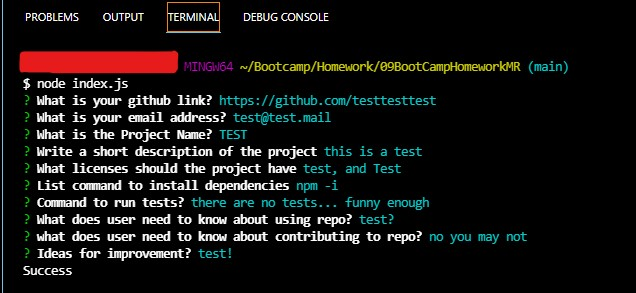
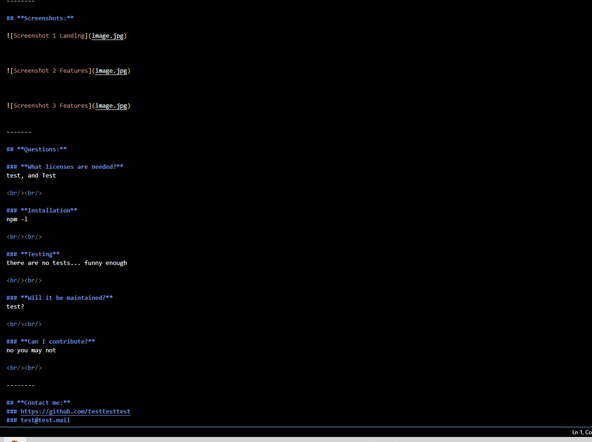

#  **README Generator** 

    

### **Navigation**

[Description](#description)

[Screenshots](#screenshots)

[Questions](#questions)

[Installation](#installation)

[Testing](#testing)

[Contact-me](#contact-me)

[Ideas-for-improvement](#ideas-for-improvement)

-------

## **Description** 
An easy to use tool for generating professional READMEs; quickly, for new projects

--------

<iframe src="https://drive.google.com/file/d/18SSVlfH20dG8jl6xfXUQTe6jzDj_IR6F/preview" width="640" height="480"></iframe>

https://watch.screencastify.com/v/ebeCgPNv81ITMhh6mmjx

---------

## **Screenshots:**

---------------

-------

## **Questions:**

### **What licenses are needed?**

 ##The intent of this project is to create a program that allows for the quick creation of a README for potential new project.
 
 
 

 MIT, NPM, Inquirer

 npm i 

 n/a

 it will not be maintained

 you cannot contribute

